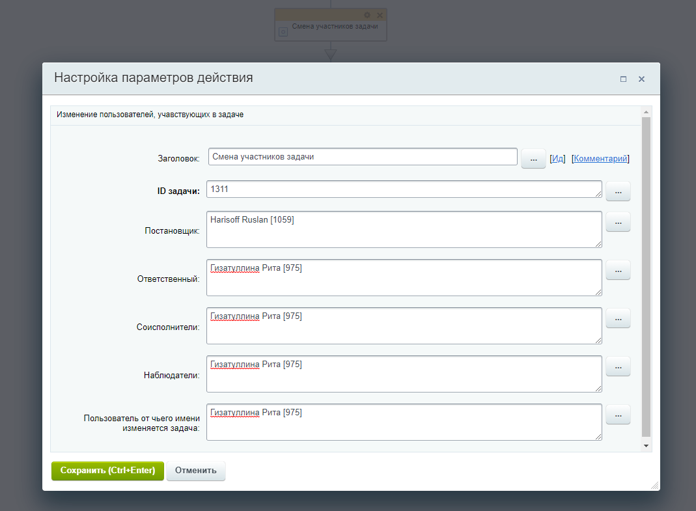

# B24_custom_activity
Разработано активити для шаблонов БП - "Смена участников задачи". 

Таким образом выглядит форма настройки действия для визуального конструктора БП:

При выполнении данного действия в бизнес-процессе, происходит переназначение участников (постановщика/ответственного/соисполнителей/наблюдателей) в указанной задаче.
В форме предусмотрена валидация полей. Например, в поле "ID задачи" можно ввести только число, а поля "Постановщик" и "Ответственный" принимают на вход только
одного пользователя. Также есть возможность выбрать пользователя, от имени которого будет изменена задача.
